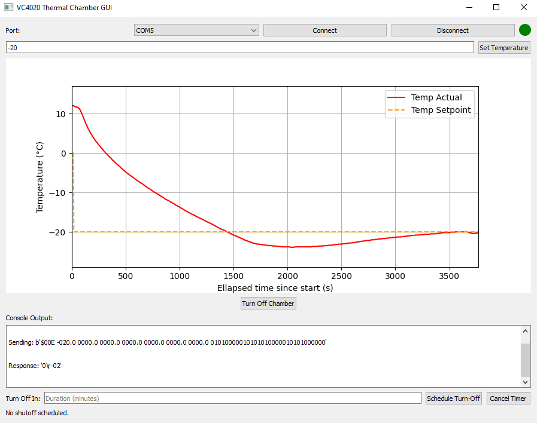

# 🔥 VC4020 Thermal Chamber GUI

A Python-based GUI to control and monitor the **Weiss Technik VC 4020 thermal chamber** via RS232.  
This application supports live plotting, temperature setpoint control, logging, and serial communication — all in one place.

---

## 🖼 Features

- ✅ Connect to the chamber via RS232
- 📉 Live plot of actual temperature vs. time
- 🎯 Set target temperature (with range validation)
- 📂 Auto-log chamber data to CSV
- 🛑 Manual “Turn Off Chamber” control
- 🧾 View all console output inside the GUI
- 💾 Automatically saves logs on disconnect or close

---

## How to use

- Chose the correct COM port if not already selected
- Click on "Connect" to initiate the chamber communication
    - The script polls the chamber every 5s
    - The live plot shows the temperature evolution for the last 2 hours
- Temperature setpoints range: [-20;40]°C
- Click on "disconnect" to stop the connection and write the logs in a csv file

## 📸 Screenshots

### 🔧 Main Interface



> _Note: Replace the above images with your actual GUI screenshots in the `docs/img/` folder._

---

## 🛠 Requirements

Install the dependencies:
```bash
pip install pyqt5 matplotlib pyserial
